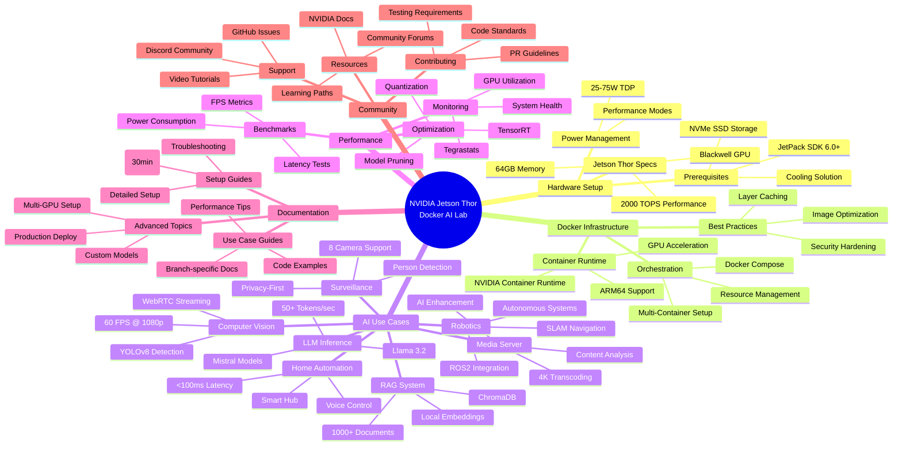

# 🚀 NVIDIA AGX Jetson Thor - Docker AI Lab

<div align="center">


**Transform your Jetson Thor into a powerful AI personal computer**

*Privacy-first • Cost-effective • Always Available • Fully Customizable*

[Quick Start](#-quick-start-0-to-running-in-30-minutes) • [Use Cases](#-use-cases) • [Setup Guide](SETUP.md) • [Contributing](#-contributing)

</div>

---

## 📋 Executive Summary

Welcome to the **ultimate guide** for unleashing the power of NVIDIA's AGX Jetson Thor platform! This repository transforms your Jetson Thor into a sophisticated AI personal computer capable of running advanced workloads entirely on-device.

**Why Jetson Thor + Docker?**
- 🔒 **Privacy-First**: All AI processing happens locally—no cloud dependency, no data leaks
- 💰 **Cost-Effective**: One-time hardware investment vs. expensive monthly AI subscriptions
- ⚡ **Always Available**: 24/7 AI capabilities with millisecond latency, no internet required
- 🎨 **Fully Customizable**: Complete control over models, configurations, and deployments
- 📚 **Learning Platform**: Hands-on experience with cutting-edge AI/ML technologies

> 💡 **Think of it as**: Having ChatGPT, DALL-E, and advanced computer vision running in your home office—completely private and always at your fingertips.

---

## 🗺️ Repository Mind Map

Get a bird's eye view of everything this repository covers:



**🎯 How to Navigate:**
- **Getting Started?** → Follow the [Quick Start](#-quick-start-0-to-running-in-30-minutes) (30 minutes)
- **Exploring Use Cases?** → Check out [AI Use Cases](#-use-cases) with dedicated branches
- **Need Help?** → Visit [Troubleshooting](#-troubleshooting) section
- **Want to Contribute?** → Read [Contributing](#-contributing) guidelines

---

## 🖥️ Hardware Requirements

### NVIDIA AGX Jetson Thor Specifications

| Component | Specification |
|-----------|---------------|
| **GPU** | NVIDIA Blackwell GPU with Tensor Cores |
| **CPU** | ARM-based CPU cluster |
| **Memory** | Up to 64GB LPDDR5X |
| **Storage** | 64GB eMMC (minimum) + NVMe SSD recommended |
| **AI Performance** | Up to 2000 TOPS (INT8) |
| **Power** | 25-75W configurable TDP |
| **Connectivity** | 10GbE, PCIe Gen 5, USB 3.2 |

### Recommended Additional Hardware
- 📦 **Storage**: 500GB+ NVMe SSD for Docker images and models
- 🌡️ **Cooling**: Active cooling solution (fan or heatsink)
- ⚡ **Power**: 65W+ USB-C PD adapter
- 🔌 **Network**: Gigabit Ethernet connection

### Software Prerequisites
- **JetPack SDK**: 6.0 or later
- **Docker**: 24.0.0+
- **NVIDIA Container Runtime**: Latest version
- **Operating System**: Ubuntu 22.04 LTS (JetPack default)

---

## ⚡ Quick Start (0 to Running in 30 Minutes)

```bash
# 1. Clone the repository
git clone https://github.com/Raveendiran-RR/Nvidia-AGX-Jetson-Thor-Docker-AI-Lab.git
cd Nvidia-AGX-Jetson-Thor-Docker-AI-Lab

# 2. Run the automated setup script
chmod +x setup.sh
./setup.sh

# 3. Verify GPU acceleration
docker run --rm --runtime nvidia --gpus all nvidia/cuda:12.2.0-base-ubuntu22.04 nvidia-smi

# 4. Deploy your first AI workload (Computer Vision example)
git checkout use-case/computer-vision
docker-compose up -d

# 5. Access the web interface
# Open browser to http://jetson-thor.local:8080
```

**🎉 Congratulations!** You now have real-time object detection running on your Jetson Thor.

For detailed setup instructions, see [SETUP.md](SETUP.md)

---

## 🏗️ Architecture Overview

```
┌─────────────────────────────────────────────────────────────┐
│                    NVIDIA AGX Jetson Thor                    │
│                                                              │
│  ┌────────────────────────────────────────────────────────┐ │
│  │              JetPack SDK 6.0+ (Ubuntu 22.04)           │ │
│  └────────────────────────────────────────────────────────┘ │
│                           │                                  │
│  ┌────────────────────────────────────────────────────────┐ │
│  │           Docker Engine + NVIDIA Container Runtime     │ │
│  └────────────────────────────────────────────────────────┘ │
│                           │                                  │
│  ┌─────────────┬──────────┴─────────┬─────────────┐        │
│  │             │                    │             │        │
│  │  Computer   │   LLM Inference   │  Robotics  │  ...   │
│  │   Vision    │     (Ollama)      │   (ROS2)   │        │
│  │  Container  │     Container     │  Container │        │
│  │             │                    │            │        │
│  │  YOLOv8 +   │   Llama 3.2 +     │  Nav2 +    │        │
│  │  WebRTC     │   Mistral         │  SLAM      │        │
│  └─────────────┴────────────────────┴────────────┘        │
│                           │                                  │
│  ┌────────────────────────────────────────────────────────┐ │
│  │         NVIDIA CUDA Cores + Tensor Cores               │ │
│  │         Hardware-Accelerated AI Inference              │ │
│  └────────────────────────────────────────────────────────┘ │
└─────────────────────────────────────────────────────────────┘
```

**Key Architectural Principles:**
1. **Containerized Isolation**: Each use case runs in its own Docker container
2. **GPU Sharing**: NVIDIA Container Runtime enables efficient GPU sharing across containers
3. **Modular Design**: Switch between use cases by changing branches
4. **Production-Ready**: All configurations optimized for 24/7 operation

---

## 🎯 Use Cases

Each use case is maintained in a separate branch with complete Docker configurations, documentation, and performance benchmarks.

| Use Case | Branch | Description | Performance | Deploy |
|----------|--------|-------------|-------------|--------|
| 🎥 **Computer Vision** | [`use-case/computer-vision`](../../tree/use-case/computer-vision) | Real-time object detection with YOLOv8 | 60 FPS @ 1080p | [](../../tree/use-case/computer-vision) |
| 🤖 **LLM Inference** | [`use-case/llm-inference`](../../tree/use-case/llm-inference) | Run Llama 3.2, Mistral, and more with Ollama | 50+ tokens/sec | [](../../tree/use-case/llm-inference) |
| 🏠 **Home Automation** | [`use-case/home-automation`](../../tree/use-case/home-automation) | AI-powered smart home hub with voice control | < 100ms latency | [](../../tree/use-case/home-automation) |
| 🦾 **Robotics** | [`use-case/robotics`](../../tree/use-case/robotics) | ROS2 integration for autonomous navigation | Real-time SLAM | [](../../tree/use-case/robotics) |
| 🎬 **Media Server** | [`use-case/media-server`](../../tree/use-case/media-server) | AI-enhanced transcoding and content analysis | 4K @ 30 FPS | [](../../tree/use-case/media-server) |
| 📚 **RAG System** | [`use-case/rag-system`](../../tree/use-case/rag-system) | Local RAG with ChromaDB and embeddings | 1000+ docs | [](../../tree/use-case/rag-system) |
| 🛡️ **Surveillance** | [`use-case/surveillance`](../../tree/use-case/surveillance) | Privacy-focused AI security with person detection | 8 cameras @ 30 FPS | [](../../tree/use-case/surveillance) |

### 📊 Performance Comparison

| Platform | Monthly Cost | Latency | Privacy | Performance (TOPS) |
|----------|--------------|---------|---------|-------------------|
| **Jetson Thor** | $0 (after hardware) | < 10ms | ✅ 100% Local | 2000 |
| OpenAI API | $200-500 | 200-500ms | ❌ Cloud-based | N/A |
| Google Cloud AI | $300-800 | 100-300ms | ❌ Cloud-based | Variable |
| AWS SageMaker | $400-1000 | 150-400ms | ❌ Cloud-based | Variable |
| Jetson Orin | $0 (after hardware) | < 15ms | ✅ 100% Local | 275 |

**💰 ROI Analysis**: Jetson Thor pays for itself in 3-6 months compared to cloud AI services!

---

## 📚 Table of Contents

### Core Documentation
- [Complete Setup Guide](SETUP.md) - From unboxing to first deployment
- [Docker Best Practices](docs/docker-best-practices.md) - Optimization tips
- [Performance Tuning](docs/performance-tuning.md) - Squeeze every bit of performance
- [Security Hardening](docs/security.md) - Production security guidelines

### Use Case Documentation
- [Computer Vision Guide](../../tree/use-case/computer-vision) - YOLOv8 implementation
- [LLM Inference Guide](../../tree/use-case/llm-inference) - Local language models
- [Home Automation Guide](../../tree/use-case/home-automation) - Smart home integration
- [Robotics Guide](../../tree/use-case/robotics) - ROS2 autonomous systems
- [Media Server Guide](../../tree/use-case/media-server) - AI-enhanced streaming
- [RAG System Guide](../../tree/use-case/rag-system) - Retrieval augmented generation
- [Surveillance Guide](../../tree/use-case/surveillance) - Security camera AI

### Advanced Topics
- [Multi-Container Orchestration](docs/orchestration.md)
- [Model Optimization with TensorRT](docs/tensorrt.md)
- [Custom Model Deployment](docs/custom-models.md)
- [Monitoring and Logging](docs/monitoring.md)

---

## 🤝 Contributing

We welcome contributions from the community! Whether it's:
- 🐛 Bug fixes
- 📝 Documentation improvements
- ✨ New use cases
- ⚡ Performance optimizations
- 🎨 Better examples

### Contribution Guidelines

1. **Fork the repository**
2. **Create a feature branch**: `git checkout -b feature/amazing-feature`
3. **Make your changes**: Follow our coding standards
4. **Test thoroughly**: Ensure it works on Jetson Thor
5. **Commit**: `git commit -m 'feat: Add amazing feature'`
6. **Push**: `git push origin feature/amazing-feature`
7. **Open a Pull Request**: Describe your changes in detail

### Code Standards
- ✅ All Docker images must support ARM64 architecture
- ✅ Include performance benchmarks for new use cases
- ✅ Document power consumption measurements
- ✅ Provide clear README with step-by-step instructions
- ✅ Test on actual Jetson Thor hardware

For detailed guidelines, see [CONTRIBUTING.md](CONTRIBUTING.md)

---

## 🔧 Troubleshooting

### Common Issues and Solutions

<details>
<summary><b>Docker daemon fails to start</b></summary>

```bash
# Check Docker service status
sudo systemctl status docker

# Restart Docker service
sudo systemctl restart docker

# Check for NVIDIA runtime
docker info | grep -i runtime
```
</details>

<details>
<summary><b>GPU not detected in container</b></summary>

```bash
# Verify NVIDIA Container Runtime installation
sudo apt-get install -y nvidia-container-runtime

# Update Docker daemon configuration
sudo nano /etc/docker/daemon.json
# Add: { "runtimes": { "nvidia": { "path": "nvidia-container-runtime" } } }

# Restart Docker
sudo systemctl restart docker
```
</details>

<details>
<summary><b>Out of memory errors</b></summary>

```bash
# Check memory usage
tegrastats

# Increase swap space
sudo fallocate -l 8G /swapfile
sudo chmod 600 /swapfile
sudo mkswap /swapfile
sudo swapon /swapfile

# Make permanent by adding to /etc/fstab
echo '/swapfile none swap sw 0 0' | sudo tee -a /etc/fstab
```
</details>

<details>
<summary><b>Slow inference performance</b></summary>

```bash
# Enable maximum performance mode
sudo nvpmodel -m 0
sudo jetson_clocks

# Verify GPU utilization
tegrastats

# Consider using TensorRT optimized models
# See docs/tensorrt.md for details
```
</details>

<details>
<summary><b>Docker image pull fails</b></summary>

```bash
# Use NVIDIA NGC registry for pre-built ARM64 images
docker login nvcr.io

# For custom images, ensure ARM64 support
docker buildx build --platform linux/arm64 -t myimage:latest .
```
</details>

For more issues, check our [GitHub Issues](../../issues) or join our [Discord community](https://discord.gg/jetson-ai-lab).

---

## 📖 Additional Resources

### Official NVIDIA Resources
- [Jetson Thor Documentation](https://developer.nvidia.com/embedded/jetson-thor)
- [JetPack SDK](https://developer.nvidia.com/embedded/jetpack)
- [NVIDIA NGC Catalog](https://catalog.ngc.nvidia.com/)
- [Jetson Community Forums](https://forums.developer.nvidia.com/c/agx-autonomous-machines/jetson-embedded-systems/)

### Community Resources
- [Jetson Hacks](https://jetsonhacks.com/) - Excellent tutorials and tips
- [Edge AI Foundation](https://www.edgeai.foundation/) - Edge AI best practices
- [Docker ARM64 Hub](https://hub.docker.com/search?architecture=arm64) - Compatible images

### Learning Resources
- [NVIDIA Deep Learning Institute](https://www.nvidia.com/en-us/training/) - Free courses
- [Docker for Edge AI](https://docs.docker.com/edge/) - Edge deployment guide
- [ROS2 Documentation](https://docs.ros.org/en/humble/) - For robotics use cases

---

## 📄 License

This project is licensed under the MIT License - see the [LICENSE](LICENSE) file for details.

### Third-Party Licenses
- NVIDIA JetPack: [NVIDIA Software License](https://developer.nvidia.com/embedded/downloads)
- Docker: [Apache License 2.0](https://github.com/docker/docker/blob/master/LICENSE)
- Individual AI models: See respective use case branches for model licenses

---

## 🙏 Acknowledgments

- **NVIDIA** for the incredible Jetson Thor platform
- **Docker** for containerization technology
- **Open source AI community** for amazing models and tools
- **Contributors** who make this project better every day
- **Special Thanks** [Ajeet Raina] ((https://github.com/ajeetraina)) who encouraged me for this initiative

---

## 📞 Support

- 📧 **issue**: [Create an issue](../../issues/new)
- 📺 **YouTube**: [Video Tutorials]([https://youtube.com/@JetsonAILab](https://www.youtube.com/@raveendiran_rr)

---

<div align="center">

**⭐ Star this repository if you find it helpful!**

**🔄 Share it with fellow AI enthusiasts!**

**🤝 Contribute and let's build the future of edge AI together!**

Made with ❤️ by the Edge AI Community

[⬆ Back to Top](#-nvidia-agx-jetson-thor---docker-ai-lab)

</div>